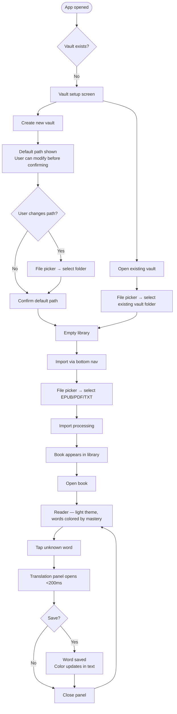
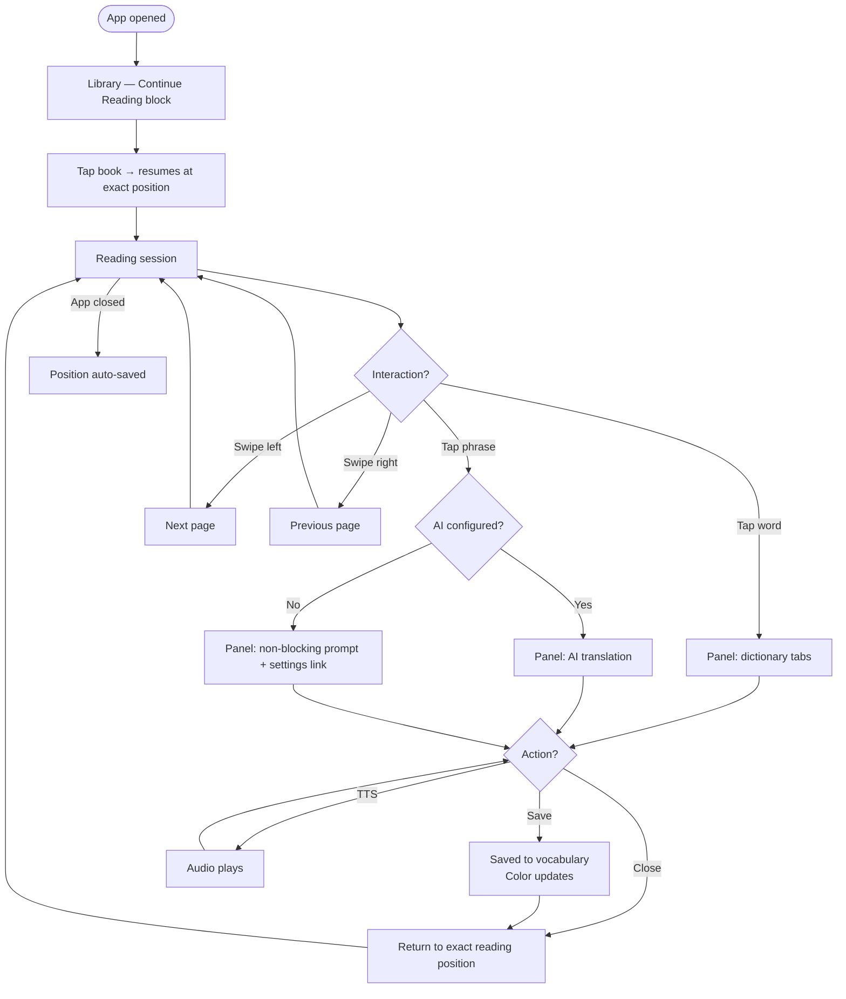
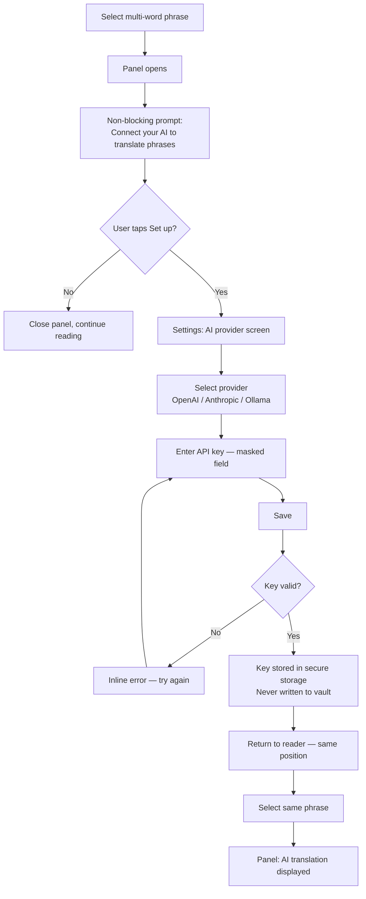
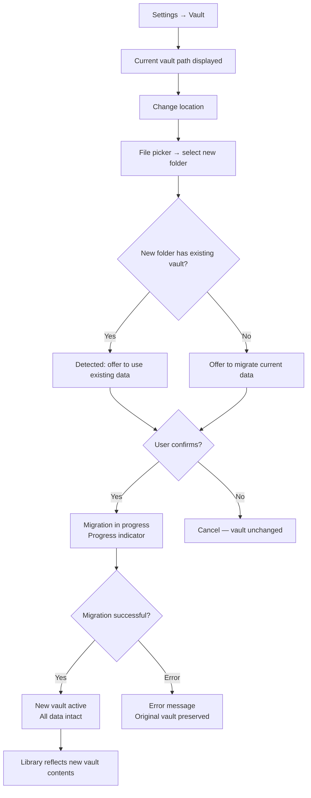

# UX Design Specification Lekto

**Author:** Damien
**Date:** 2026-03-07

---

## Executive Summary

### Project Vision

Lekto is a local-first immersive reading app for language learning. It replicates the LingQ experience — content import, word coloring by mastery level, integrated contextual lookup, and vocabulary management — on a fully local architecture: no server required, no subscription, user data stays on the device.

The core experience is a fluid loop: import a book → read with mastery-level word coloring → tap a word or phrase → instant translation (dictionary or AI) → save to vocabulary. Every step is immediate, local, and uninterrupted.

### Target Users

**The Reader**: standard app comfort, wants to "open and read" immediately with zero configuration. Unfamiliar with API keys or vault folders. The app must work 100% out-of-the-box — vault auto-created, dictionaries active without setup. Advanced features are discoverable but never imposed (progressive disclosure).

**The Power User**: developer or tech-savvy profile, already subscribed to LLM services (OpenAI, Anthropic, Ollama), uses folder-based sync tools (Syncthing, rclone, cloud folder). Wants to connect their own AI, control vault location, and access advanced configuration directly without being hand-held.

### Key Design Challenges

1. **Simplicity vs. power tension**: The Reader must be able to start reading within one minute of installation, while the Power User accesses advanced configuration — same interface, two coexisting complexity levels without friction.

2. **Translation panel without breaking reading flow**: Opens within <200ms, dictionary + AI + TTS in a compact panel that preserves reading context. This is the most repeated interaction and the most critical UX moment in the product.

3. **Vault onboarding**: A single, one-time first-launch screen offering two clear choices — "Create a new vault" (primary, prominent) and "Open an existing vault" (secondary). The Reader clicks the primary action in seconds and never thinks about it again; the Power User finds what they need immediately. Vault location can be changed at any time from settings, with an option to migrate existing data to the new location.

4. **Web / Android consistency**: Experience parity across two platforms with different interaction paradigms (click/mouse vs. tap/swipe, File System Access API vs. Capacitor plugins).

### Design Opportunities

1. **Immediate "aha moment"**: Zero friction between installation and the first word tapped — a strong differentiator against LingQ, which requires an account before any reading can happen.

2. **Exemplary progressive disclosure**: The BYOK AI onboarding as a reference pattern — advanced feature naturally discoverable, never imposed, guided setup when the user is ready.

3. **Translation panel as visual signature**: The most repeated interaction, the most refined — speed, information hierarchy (definition → examples → TTS → save), compactness.

---

## Core User Experience

### Defining Experience

The single defining interaction of Lekto is: **tap a word while reading and get an instant translation**. Everything else — import, vault, vocabulary management — exists in service of this moment. If this interaction is fluid, the product succeeds. If it stutters or requires effort, nothing else compensates.

### Platform Strategy

Lekto is a hybrid Web + Android application (Capacitor / React / Vite / TypeScript). The web app is the primary development target; the Android app is the same codebase in a native container. Both platforms share the same local-first architecture and vault-based storage.

Interaction paradigms differ by platform — click/mouse on web, tap/swipe on Android — but the experience must feel equally native on both. Platform-specific capabilities (File System Access API on web, Capacitor plugins on Android) are used where available; graceful fallbacks where not.

The app is fully offline by design. Network access is used only for dictionary lookups, BYOK AI translation, and TTS — all of which degrade gracefully when offline.

### Effortless Interactions

The following interactions must require zero conscious effort from the user:

- **Session resume**: opening the app returns the user to exactly where they left off — correct book, correct position, no searching or scrolling
- **Word lookup**: tap → panel opens instantly with translation ready to read, no additional manipulation required
- **Vocabulary save**: one action from the translation panel, word saved with context
- **Cross-device continuity**: progress and vocabulary sync transparently via the user's vault folder — no manual action required beyond the initial vault setup

### Critical Success Moments

1. **First launch → first word translated**: if this path takes more than one minute or requires any configuration, the Reader is lost. This moment must be explicitly designed and protected.

2. **The translation panel**: any perceptible latency, any confusing layout, any interaction that forces the user to leave the reading page breaks the reading flow — and is unrecoverable. This is the make-or-break interaction.

3. **Session resume**: if a user must manually find their page after closing the app, abandonment is likely. Resume must be automatic and precise.

### Experience Principles

1. **Reading first** — every design decision is evaluated against one criterion: does this protect or disrupt the reading flow?

2. **Instant gratification** — the product's value must be visible within the first 60 seconds, with no prior configuration required.

3. **Progressive complexity** — advanced features (AI, vault relocation, settings) exist but never impose themselves; they wait until the user is ready.

4. **Invisible infrastructure** — the local mechanics (vault, sync, storage) are entirely transparent to the Reader; the Power User can access them whenever they choose.

---

## Desired Emotional Response

### Primary Emotional Goals

Lekto's target emotional response is **polished normalcy** — the positive surprise of finding something clean, consistent, and accessible behind an open source project. Like Obsidian or Signal: open source without apologizing for it, an interface that does not betray its origins.

The user should feel: *"This works, it's clean, it's consistent"* — on web and Android alike, without any jarring transitions or rough edges.

### Emotional Journey Mapping

| Stage | Desired Feeling |
|-------|----------------|
| First launch | "I didn't have to configure anything to start reading" |
| Core reading loop | Absorbed, uninterrupted — the app disappears, only the text remains |
| Reading customization | "I can adjust this exactly how I like it" — without feeling overwhelmed |
| Advanced features (AI, vault) | Discoverable when needed, invisible when not |
| Returning user | Immediate resume, no friction — the habit forms naturally |

### Micro-Emotions

- **Confidence, not anxiety**: the app never creates the impression that something needs to be set up before it can be used
- **Finished, not beta**: every interaction must feel complete and deliberate — no rough edges, no "experimental" feel
- **Capable, not complex**: reading customization (font, size, theme) is welcomed and expected; infrastructure settings (vault, AI) are accessible but never foregrounded

### Design Implications

- **Configuration ratio**: reading settings are prominent and expected; infrastructure settings (vault location, AI provider) exist in a dedicated area, never surfaced unless sought
- **Defaults that work**: every default must be the right choice for the Reader — no setting should ever need to be changed for the core experience to work perfectly
- **Visual consistency**: identical design language across web and Android; a screen seen on one platform should feel immediately familiar on the other
- **No setup anxiety**: the app never presents a wall of configuration before delivering value; the first interaction is always reading, never setup

### Emotional Design Principles

1. **Normalcy as ambition** — the goal is not to impress, but to feel completely natural. An open source app that feels as polished as a commercial product is the achievement.

2. **Reading settings yes, system settings no** — configuration is welcome when it serves the reading experience; configuration for its own sake is a failure mode.

3. **Silence is quality** — the best infrastructure is invisible. Vault, sync, and data management should never demand the user's attention during a reading session.

---

## UX Pattern Analysis & Inspiration

### Inspiring Products Analysis

**Moon+ Reader / Readera** — the direct reference for the reader experience. Full-screen reading, minimal chrome, rich reading customization (font, size, theme, margins), tap zones for page navigation. The reading content is king; the interface recedes. The reading customization model is to be adopted almost directly.

**Spotify** — the "mini player → full panel" pattern maps precisely to Lekto's translation panel: a compact bar at the bottom that expands into a full bottom sheet without leaving the current screen. The primary content remains visible and contextualized behind the panel. A proven, immediately understood pattern.

**Obsidian** — proof that local-first + vault architecture can be a mainstream UX, not a developer-only tool. Key takeaway: defaults work without configuration; advanced configuration is available for those who seek it. What to avoid: Obsidian's initial learning curve — Lekto must be more immediately usable.

**Anki** — useful for vocabulary management patterns (confidence levels, card-based review). The desktop interface is precisely the "open source = utilitarian" stereotype Lekto must break. The mobile Anki app is better — confirmation that a solid data model can be dressed in a modern UX.

**Duolingo** — micro-interaction fluidity and clear visual progress. The aggressive gamification (streaks, guilt-driven notifications, social pressure) is an explicit anti-pattern for Lekto — users must never feel pressured or penalized for not opening the app.

**Podcast apps (Pocket Casts, etc.)** — queue management, exact position resume, offline downloads. The precise resume pattern is directly applicable: these apps have solved the same continuity problem Lekto must solve for reading sessions.

### Transferable UX Patterns

| Pattern | Source | Application in Lekto |
|---------|--------|----------------------|
| Expandable bottom sheet | Spotify | Translation panel — compact on tap, expandable for more detail |
| Full-screen + minimal chrome | Moon+ / Readera | Reader — UI recedes, tap to reveal controls |
| Tap zones for navigation | Moon+ | Next/previous page navigation on Android |
| Exact position resume | Podcast apps | Automatic and precise reading position restore |
| Defaults that work | Obsidian | Auto-created vault, dictionaries active without setup |
| Visual confidence levels | Anki | Mastery coloring + level indicator at save |

### Anti-Patterns to Avoid

- **Coercive gamification** (Duolingo): streaks, guilt notifications, progression pressure — irrelevant and counterproductive for a reading tool
- **Utilitarian "open source" interface** (Anki desktop): functional but visually dated — exactly the stereotype Lekto must break
- **Steep initial learning curve** (Obsidian): too many choices at first launch — Lekto must be immediately usable with zero onboarding friction

### Design Inspiration Strategy

**Adopt:**
- Moon+ / Readera reading customization model — font, size, theme, margins as first-class settings
- Spotify bottom sheet pattern — for the translation panel interaction
- Podcast apps' exact resume — for reading position persistence

**Adapt:**
- Obsidian's vault philosophy — keep the local-first model, remove the configuration complexity at first launch
- Anki's confidence levels — apply to word mastery coloring with a cleaner, more modern visual treatment

**Avoid:**
- Any gamification mechanic that creates pressure or guilt
- Infrastructure-first onboarding — the user's first interaction is always reading content, never system setup

---

## Design System Foundation

### Design System Choice

**shadcn/ui + Tailwind CSS**

### Rationale for Selection

- **Components owned by the project**: shadcn/ui copies components directly into the codebase — no external library dependency, full modification freedom, no version lock-in
- **Visual consistency at low cost**: Tailwind's utility-first approach enforces consistent spacing, color, and typography across web and Android (Capacitor) without custom CSS overhead
- **React ecosystem alignment**: the dominant combination in the React/Vite ecosystem in 2025-2026 — extensive community resources, open source examples, and contributor familiarity
- **Accessibility built-in**: shadcn/ui is built on Radix UI primitives, which provide WCAG-compliant accessible components out of the box
- **Capacitor compatibility**: no browser-specific dependencies that would conflict with the Android wrapper

### Implementation Approach

- Start with the shadcn/ui component set as a base (Button, Sheet, Dialog, Tabs, Input, etc.)
- Use Tailwind design tokens (colors, spacing, typography) for all custom components
- Define a small set of semantic color tokens for mastery levels (unknown → known) as CSS custom properties
- Dark / light / sepia themes implemented via Tailwind's `dark:` variant and a theme class on the root element

### Customization Strategy

- **Mastery level colors**: custom token set (5 levels) defined outside shadcn defaults — these are core to the product identity
- **Reading typography**: font family, size, and line-height controlled via CSS custom properties toggled from reading settings — no Tailwind class switching needed at runtime
- **Bottom sheet / translation panel**: built on shadcn's Sheet component, customized for the bottom-anchored translation panel pattern
- **Minimal branding**: no heavy visual identity — clean, neutral, content-first aesthetic that keeps the focus on the text being read

---

## Defining Core Interaction

### Defining Experience

Lekto's signature interaction in one sentence: **"I'm reading, I tap a word I don't know, and the translation is there."**

The mental model is already formed — LingQ and Readlang users know this pattern. No user education needed. The goal is flawless execution, not innovation.

### User Mental Model

Users approach this interaction with a simple expectation: tap → see translation. The word coloring by mastery level acts as an implicit invitation — unknown words are visually distinct, signaling they are interactive. The user does not need to learn a gesture or discover a hidden action; the visual design guides them naturally.

Current solutions (LingQ, Readlang) validate that this mental model is correct and widely understood. Lekto does not need to reinvent it — only to execute it faster and more cleanly.

### Success Criteria

- Translation panel opens in <200ms after tap/click — imperceptible latency
- The tapped word remains highlighted and visible in the text behind the open panel
- Dictionary results are immediately readable without scrolling or additional taps
- Vocabulary save requires exactly one tap from the panel — no form, no confirmation dialog
- Closing the panel returns the user to the exact reading position — no repositioning needed

### Novel vs. Established Patterns

This is an **established pattern** executed with precision. The interaction model is borrowed from existing immersive reading tools. The differentiation lies in:

- Speed: <200ms vs. the perceptible latency of web-based competitors
- Context preservation: the text remains visible behind the panel — the user never loses their place
- Save simplicity: one tap, not a multi-step form

The bottom sheet implementation (Spotify-inspired) is a refinement of the pattern, not an invention. Users familiar with any modern mobile app will understand it immediately.

### Experience Mechanics

**1. Initiation**
- User reads text; unknown/low-mastery words are colored distinctly
- Word coloring is the implicit affordance — no tooltip, no instruction needed
- Trigger: single tap (Android) or click (web) on any word

**2. Interaction**
- Bottom sheet slides up from the edge of the screen (<200ms)
- Text content remains visible above the panel, word stays highlighted
- For a single word: dictionary tabs displayed immediately (WordReference, Reverso, Google Translate, Linguee)
- For a multi-word selection: AI translation if a provider is configured; otherwise a non-blocking inline prompt — *"Connect your AI to translate phrases"* with a settings link
- TTS button accessible directly in the panel header
- "Save" button prominent in the panel — one tap saves the word with its context sentence

**3. Feedback**
- Panel opens instantly — no loader, no spinner
- Selected word remains highlighted throughout the lookup session
- On save: the word's color in the text updates immediately to reflect the new mastery level — confirmation that the save happened without a modal or toast
- On error (offline, dictionary unavailable): inline non-blocking message inside the panel — reading session is never interrupted

**4. Completion**
- User closes the panel: swipe down, tap outside the panel, or close button
- Returns instantly to reading at the exact same scroll position
- No navigation step, no back button — the reading session resumes seamlessly

---

## Visual Design Foundation

### Color System

**Mastery Level Palette** — the most important color system in the product:

| Level | Meaning | Color |
|-------|---------|-------|
| 0 — Unknown | New word, never seen | Blue (strong highlight) |
| 1 — Familiar | Seen once | Yellow |
| 2 — Recognized | Partially acquired | Light orange |
| 3 — Mastered | Nearly acquired | Light green |
| 4 — Known | Fully acquired | No highlight (normal text) |

Level 4 carries no color — known words are invisible in the system, which reinforces the sense of progress: the fewer highlighted words, the more the user has learned.

**App Accent Color** — a single neutral accent (e.g., slate blue or indigo) used for primary actions (buttons, links, active states). Must not compete visually with the mastery level colors.

**Reading Themes** — three standard themes:

| Theme | Background | Text | Use case |
|-------|-----------|------|----------|
| Light | White / off-white | Near-black | Default, bright environments |
| Dark | Dark gray / near-black | Off-white | Low-light reading |
| Sepia | Warm beige | Dark brown | Reduced eye strain, paper feel |

All color combinations must meet WCAG 2.1 AA contrast ratios. Mastery level colors are supplemented with non-color indicators (underline style or subtle pattern) for colorblind users.

### Typography System

**UI Typography** — system font stack: `system-ui, -apple-system, sans-serif`. Fast, native, zero loading time, platform-consistent. Used for all app chrome: library, panels, settings, navigation.

**Reading Typography** — user-configurable:

| Setting | Default | Options |
|---------|---------|---------|
| Font family | Georgia (serif) | Georgia, Lora, Open Sans, system-ui |
| Font size | 18px | 14px – 26px (slider) |
| Line height | 1.7 | 1.4 – 2.0 (slider) |
| Margins | Medium | Narrow / Medium / Wide |

Serif default for long-form reading comfort. Sans-serif available for user preference. All controlled via CSS custom properties — no runtime class switching.

**Type Scale (UI)** — Tailwind defaults: `text-sm`, `text-base`, `text-lg`, `text-xl`, `text-2xl`. No custom scale needed.

### Spacing & Layout Foundation

- **Base unit**: 4px — standard Tailwind spacing scale, consistent and predictable
- **Overall density**: airy — a reading product should never feel crowded
- **Reader column width**: constrained to ~65–70 characters per line for optimal reading comfort; centered with generous lateral margins
- **Touch targets**: minimum 48×48dp on Android for all interactive elements (WCAG and Material guidance)
- **Panel heights**: translation panel — compact default (~40% viewport height), expandable to ~70% for detailed dictionary view

### Accessibility Considerations

- All mastery level colors supplemented with non-color visual indicators (underline style variation) for colorblind users
- WCAG 2.1 AA contrast ratios enforced across all three reading themes
- All interactive elements keyboard-navigable on web (Tab, Enter, Space, Escape to close panel)
- ARIA labels on all interactive elements; Android content descriptions for TalkBack
- Reader respects system font size setting on Android
- Minimum touch target 48×48dp throughout the Android app

---

## Design Direction Decision

### Design Directions Explored

Five directions were explored across three key screens (library, reader, translation panel): Light Minimal (A), Dark Focused (B), Sepia Warm (C), Web Split (D), Compact List (E). Full mockups available in `ux-design-directions.html`.

### Chosen Direction

A composite direction combining the strongest elements from each exploration:

**Library**: Sepia palette + compact list layout (Direction C+E). "Continue reading" hero block at the top showing the last opened book. Search bar below the hero for large library navigation. Import action moved to the bottom navigation bar — no dedicated prominent button. Progress shown as percentage only (no bar needed). Language filter chips for multi-language libraries.

**Reader**: Light is the default theme; Sepia and Dark are fully available and switchable from reading settings. Default reader layout from Direction A: top bar with back arrow + book title, bottom bar with "Chapter X · p. Y / Z" + swipe hint. Minimal chrome — tap anywhere outside text to toggle controls.

**Translation panel**: Direction A/C. Bottom sheet, handle, word + TTS button + Save button in header, dictionary tabs, mastery level selector. No changes to structure.

**Icon set**: Lucide Icons — flat, consistent stroke weight, natively integrated with shadcn/ui. No emoji placeholders in production UI.

**Tablet**: Addressed as a first-class target. Library adapts to 2-column grid. Reader benefits from generous margins with constrained text column. Translation panel becomes a persistent side panel rather than a bottom sheet, using the available horizontal space (equivalent to Direction D but at proper tablet resolution).

**Web (desktop, 1440px)**: Sidebar navigation + reader + persistent side translation panel — all three columns always visible. No bottom sheet needed. Full mockup at 1440px in `ux-design-directions.html`.

### Design Rationale

- **Sepia palette**: distinctive visual identity that breaks the "utilitarian open source" stereotype while remaining calm and reading-appropriate. Warm tones reduce eye strain for long sessions.
- **List library**: more information visible per scroll unit — essential for users with large multi-language libraries. "Continue reading" hero solves the resume pattern prominently.
- **Search bar**: necessary at any library size; borrowed from Direction B where it works naturally.
- **Import in bottom nav**: import is an occasional action, not a primary one. Elevating it to a hero button overstates its importance relative to reading.
- **Sepia as default theme**: sepia is the default reading theme; Light and Dark are fully available and switchable from reading settings at any time.
- **Lucide icons**: already in the dependency tree via shadcn/ui; flat, clean, professional.
- **Tablet as first-class**: the reading use case is ideal for tablet (larger screen, held in hands). Side panel on tablet eliminates the bottom sheet overlay, making dictionary lookup and reading coexist without obstruction.

### Implementation Notes

- Responsive breakpoints: mobile (<768px) → tablet (768px–1024px) → desktop (>1024px)
- Library: list on mobile, 2-col grid on tablet, list with wider rows on desktop (inside sidebar layout)
- Translation panel: bottom sheet on mobile, side panel on tablet and desktop
- Bottom navigation: present on mobile and tablet; replaced by sidebar on desktop

---

## User Journey Flows

### Journey 1 — First Launch → First Word Translated

The most critical journey: vault setup → import → read → tap → translation. The "aha moment" that determines whether the Reader stays.

### Journey 2 — Daily Reading Session

The repeating value loop. Resume → read → lookup → save → close.

### Journey 3 — AI Discovery and Setup

Progressive disclosure in action: phrase selection surfaces the AI feature without forcing it.

### Journey 4 — Vault Relocation

Accessible from settings at any time. Handles both migration and connection to an existing vault.

### Journey Patterns

| Pattern | Applied in |
|---------|-----------|
| **Default with override** — show the smart default, let the user change it before confirming | Vault creation (Journey 1) |
| **Non-blocking progressive disclosure** — surface advanced features inline without interrupting flow | AI setup prompt (Journey 3) |
| **Exact position restore** — every exit point saves state; every re-entry restores it | All journeys |
| **Inline error recovery** — errors appear where the action was, never as full-screen interruptions | AI key validation, offline states |
| **Safe migration** — destructive-looking operations preserve the original until success is confirmed | Vault relocation (Journey 4) |

---

## Component Strategy

### Design System Components (shadcn/ui)

| Component | Usage in Lekto |
|-----------|---------------|
| `Button` | All actions — Save, Import, Confirm, Cancel |
| `Sheet` | Base for the translation panel (bottom sheet) |
| `Tabs` | Dictionary source tabs in the translation panel |
| `Dialog` | Confirmations — book deletion, vault migration |
| `Input` | Library search bar, API key field |
| `Slider` | Reading settings — font size, line height |
| `Select` | Font family picker, AI provider selector |
| `Progress` | Import processing indicator |
| `Badge` | Language indicator on library book items |
| `Separator` | Divisions in panels and settings screens |

### Custom Components

Seven custom components are required for interactions unique to Lekto with no shadcn/ui equivalent.

#### `WordToken`

**Purpose:** Interactive word span in the reader — the most critical component in the product.
**Content:** A single tokenized word with its mastery level state.
**Actions:** Tap/click to open the translation panel.
**States:** `unknown` · `familiar` · `recognized` · `mastered` · `known` · `selected`
**Accessibility:** `role="button"`, `aria-label="[word] — level [n]"`. Non-color indicator (underline style varies by level) for colorblind users.

#### `TranslationPanel`

**Purpose:** The bottom sheet translation and lookup panel — the signature interaction of the app.
**Content:** Word header + TTS button + Save button · Dictionary tabs (word mode) or AI translation (phrase mode) · Mastery selector.
**States:** `word` (dictionary tabs) · `phrase-ai` (AI translation) · `phrase-no-ai` (non-blocking prompt) · `loading` · `offline` (inline graceful message)
**Built on:** shadcn `Sheet`, bottom-anchored, adaptive height (~40% default, ~70% expanded).

#### `MasterySelector`

**Purpose:** Inline confidence level selector at the bottom of the translation panel.
**Content:** 5 compact buttons — 1, 2, 3, 4, ✓ (Known) — color-coded by mastery level.
**Actions:** Single selection; tapping a level saves it and updates the word color in the reader.
**Accessibility:** Keyboard navigable (arrow keys), `role="radiogroup"`.

#### `ContinueReadingCard`

**Purpose:** Hero block at the top of the library showing the last opened book.
**Content:** Book cover · title · chapter · progress percentage · resume button.
**States:** Visible when at least one book has been opened; hidden on empty library.

#### `BookListItem`

**Purpose:** Single row in the library list.
**Content:** Miniature cover · title · author · language badge · progress percentage.
**States:** Default · pressed/active.
**Constraints:** Touch target ≥48dp height on Android.

#### `ReaderPage`

**Purpose:** Container for the immersive reading view — renders tokenized text, handles navigation gestures, manages chrome visibility.
**Content:** Tokenized `WordToken` sequence, top bar (back + title), bottom bar (chapter + page + swipe hint).
**Actions:** Swipe left (next page) · swipe right (previous page) · tap outside text (toggle chrome visibility) · tap `WordToken` (open panel).
**States:** `chrome-visible` · `chrome-hidden` · `panel-open`.

#### `VaultSetupScreen`

**Purpose:** One-time first-launch screen for vault initialization.
**Content:** App name · two options: "Create new vault" (primary) and "Open existing vault" (secondary). Default path shown with modify option before confirmation.
**States:** `create-flow` (path display + modify + confirm) · `open-flow` (file picker).
**Usage:** Shown once on first launch only; never shown again after vault is set.

### Component Implementation Strategy

- All custom components are built using Tailwind utility classes and shadcn/ui primitives — no external component libraries beyond the established stack
- Design tokens (mastery level colors, reading theme variables) defined as CSS custom properties at the root level, consumed by all components
- `WordToken` and `ReaderPage` are performance-sensitive — rendering must handle books of 300+ pages without degradation; tokenized content rendered in virtual chunks where needed
- `TranslationPanel` animation: slide-up on open, slide-down on close — 200ms ease-out, hardware accelerated

### Implementation Roadmap

**Phase 1 — Core (MVP critical)**
- `VaultSetupScreen` — first launch gate
- `WordToken` — reader cannot function without it
- `ReaderPage` — container for the core experience
- `TranslationPanel` — lookup and save flow
- `MasterySelector` — integrated inside `TranslationPanel`

**Phase 2 — Library**
- `ContinueReadingCard` — resume pattern
- `BookListItem` — library list view

**Phase 3 — Polish**
- `TranslationPanel` offline and error states
- Transition animations (panel slide, word color update on save)
- Tablet layout variants (side panel instead of bottom sheet)

---

## UX Consistency Patterns

### Button Hierarchy

| Level | Style | Usage |
|-------|-------|-------|
| Primary | Dark background, white text | One per screen maximum — Save, Confirm, Import |
| Secondary | Outlined, transparent background | Alternative actions — Cancel, Modify, Skip |
| Ghost | Text only, no border | Tertiary actions — settings link in AI prompt |
| Destructive | Red / danger | Irreversible actions — delete book, clear vault |

**Rule:** never two primary buttons on the same screen. The Save button in `TranslationPanel` is always primary.

### Feedback Patterns

| Situation | Pattern | What to avoid |
|-----------|---------|---------------|
| Vocabulary save | Word color updates immediately in the text — direct visual feedback, no toast | Toast/snackbar obscuring the text |
| Import in progress | Inline progress bar in the library | Full-screen blocking loader |
| Offline | Inline message inside the panel ("Dictionary unavailable offline") | Modal alert, crash |
| AI error (invalid key, timeout) | Inline message in panel, reading session uninterrupted | Error modal |
| Vault migration | Progress indicator; original preserved until success confirmed | Silent operation without feedback |

### Navigation Patterns

**Mobile / Tablet — Bottom navigation (4 items):**
- **Library** — book list and continue reading
- **Import** — file picker trigger, first-level action
- **Vocabulary** — saved words and phrases
- **Settings** — vault, AI provider, reading preferences

**Desktop — Persistent sidebar:** same 4 sections + recent books list below.

**Inside the reader:** no global navigation visible. Minimal top bar (back arrow + book title only). Chrome toggled by tapping outside the text. Back navigation via explicit back button only — swipe-to-go-back is disabled to avoid conflict with page swipe gestures.

### Empty States

| Screen | Empty state message |
|--------|-------------------|
| Library | "No books yet — tap Import to add your first book" |
| Vocabulary | "No words saved yet — tap a word while reading to save it" |
| Translation panel (loading) | Skeleton loader visible only if load exceeds 200ms |

Empty states are instructional — they tell the user what to do next. Never decoratively complex.

### Form Patterns

- **API key field**: masked by default, reveal toggle available. Validated on save, not in real time. Inline error on failure.
- **Vault path field**: read-only display with a separate "Change" button — users never type a path manually, always use the file picker.
- **Reading settings** (font size, line height, theme): sliders and selects with immediate live preview in the reader — no Save button needed, changes apply instantly.

---

## Responsive Design & Accessibility

### Responsive Strategy

| Breakpoint | Size | Behaviour |
|-----------|------|-----------|
| Mobile | < 768px | Bottom nav (4 items) · Library as list · Translation panel as bottom sheet · Minimal reader chrome |
| Tablet | 768–1024px | Bottom nav retained · Library as 2-column grid · Translation panel as fixed side panel · Reader with generous margins |
| Desktop | > 1024px | Fixed sidebar (nav + recent books) · Library as wide list · Side translation panel always visible · 3-column layout |

Mobile-first approach using Tailwind breakpoints (`md:`, `lg:`). Single React codebase — adaptation via responsive utility classes, no platform-specific logic branches.

### Breakpoint Strategy

Standard Tailwind breakpoints:
- `sm`: 640px — minor adjustments
- `md`: 768px — tablet layout switches (side panel, grid library)
- `lg`: 1024px — desktop layout switches (sidebar, 3-column)

The most critical breakpoint is `md` — this is where the translation panel transitions from bottom sheet to side panel, and the most significant layout changes occur.

### Accessibility Strategy

Target: **WCAG 2.1 Level AA** — industry standard, required by the PRD.

| Requirement | Implementation |
|-------------|---------------|
| Color contrast | WCAG AA ratios enforced on all 3 themes (Light, Dark, Sepia) |
| Mastery colors | Supplemented with non-color underline style variation per level |
| Keyboard navigation (web) | Full Tab / Enter / Space / Escape support across all screens |
| Screen readers (web) | ARIA labels and roles on all interactive elements |
| Screen readers (Android) | TalkBack content descriptions on all interactive elements |
| Touch targets | Minimum 48×48dp on Android throughout |
| System font size | Reader respects Android system font size setting (`sp` units via Capacitor) |
| Focus indicators | Visible focus rings on all interactive elements on web |

### Testing Strategy

| Area | Method |
|------|--------|
| Color contrast | Tailwind color checker + manual verification on all 3 themes |
| Colorblindness | Chrome DevTools simulation (Deuteranopia, Protanopia) on mastery colors |
| Keyboard navigation | Manual testing of critical flows (reader, panel, settings) |
| TalkBack (Android) | Tested on physical Android device — emulator insufficient for gesture testing |
| Screen reader (web) | NVDA on Chrome (Windows) or VoiceOver on macOS |
| Responsive layout | Chrome DevTools device emulation + physical device testing on mobile and tablet |

### Implementation Guidelines

**Responsive development:**
- Mobile-first media queries — base styles for mobile, override at `md:` and `lg:`
- Relative units (`rem`, `%`, `dvh`) — never fixed `px` for layout dimensions
- Touch targets sized with `min-h-[48px] min-w-[48px]` utility classes on Android-targeted components
- Translation panel: `Sheet` component with `side="bottom"` on mobile, `side="right"` on tablet/desktop

**Accessibility development:**
- Semantic HTML — `<button>`, `<nav>`, `<main>`, `<article>` used correctly
- `WordToken` exposes `role="button"` and `aria-label="[word], level [n]"`
- `TranslationPanel` traps focus while open; returns focus to the triggering `WordToken` on close
- `MasterySelector` uses `role="radiogroup"` with `role="radio"` per level button
- Reading theme preference stored locally — no system-level override needed
